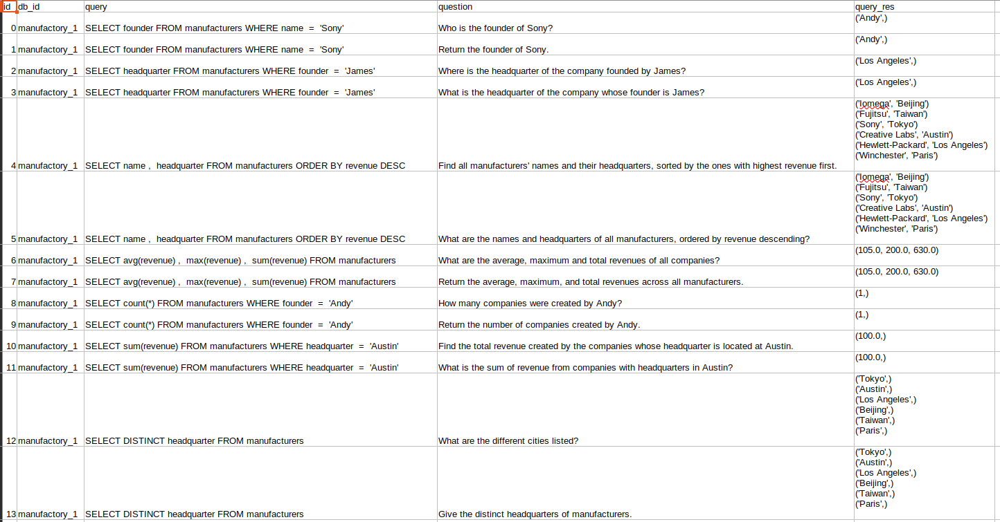

# llm-sql-qa-testing-suite

answers are in --> `questions/{name of database}.csv`
db scripts are in --> `postgres` and `sqlite`

##### INFO
* Original databases from Spider 1.0 [benchmark] https://github.com/taoyds/spider // https://yale-lily.github.io/spider
* Original Paper: [paper] https://aclanthology.org/D18-1425.pdf
* handpicked which ones to use based on number of testing questions, domain, and database size in correlation with # of testing questions.
* testing questions from the HF dataset [spider] https://huggingface.co/datasets/CM/spider

##### What a question CSV looks like:

##### TODO:
- functions to get n number of questions from a database
- create some non-relational dbs
- create unstructured data

##### Good tools
- https://www.eraser.io/ai/erd-generator